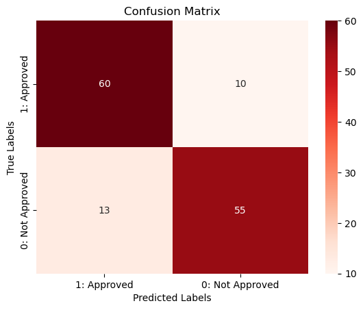

# Credit Card Approval Prediction | Logistic Regression

## INTRODUCTION
This project aims to predict whether a credit card application will be approved or not using **Logistic Regression**. The dataset contains various financial and demographic attributes of applicants.

---

## PROBLEM STATEMENT
Credit card issuers need a robust model to determine which applicants should be approved based on financial stability and risk factors. This project applies machine learning to automate and optimize this decision-making process.

---

## SKILL DEMONSTRATION
- Data Preprocessing
- Exploratory Data Analysis (EDA)
- Feature Engineering
- Logistic Regression Modeling
- Model Evaluation

---

## DATA SOURCING
The dataset used in this project includes features such as:
- Applicant’s income
- Credit history
- Debt-to-income ratio
- Age, employment status, and other demographic details

---

## DATA TRANSFORMATION
- Handling missing values
- Encoding categorical variables
- Feature scaling using standardization/normalization

---

## MODELLING
- Built a **Logistic Regression** model for binary classification.
- Tuned hyperparameters to optimize model performance.
- Used a **train-test split** to evaluate generalization performance.

---

## ANALYSIS & VISUALIZATION
- Distribution of approved vs. rejected applications.
- Correlation heatmaps for feature selection.
- Model evaluation using:
  - Accuracy Score
  - Confusion Matrix
  - Precision, Recall, and F1-score

## CONCLUSION
The **Logistic Regression** model provides a reliable baseline for predicting credit card approvals. Further improvements can be made by incorporating ensemble methods or deep learning models.
